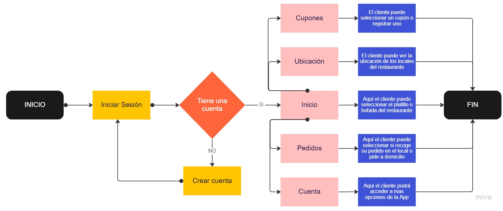
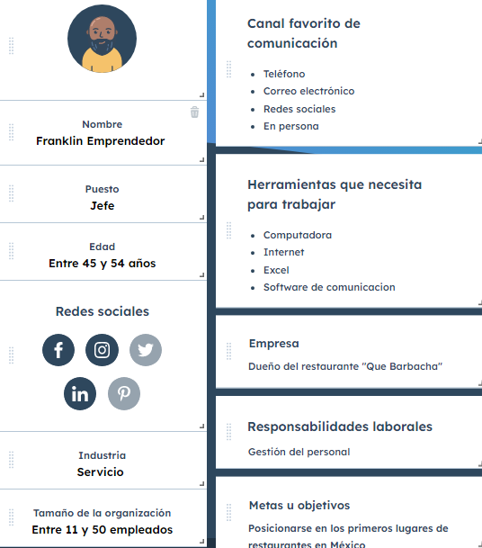
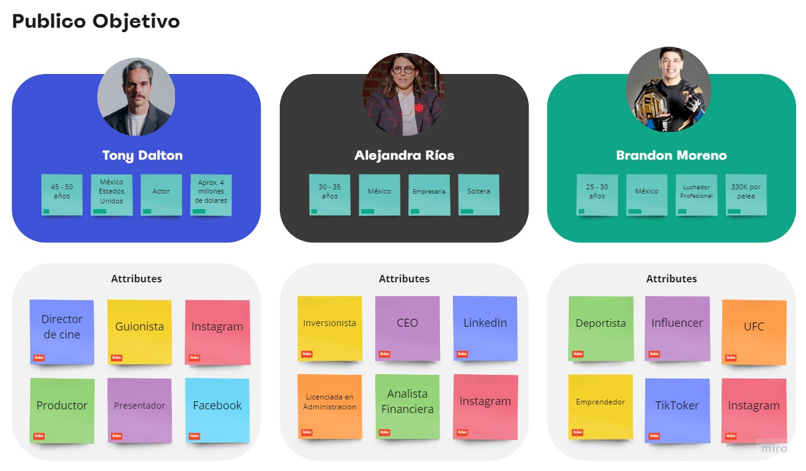
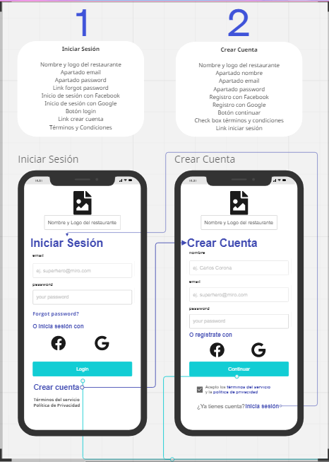
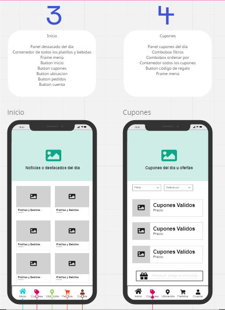
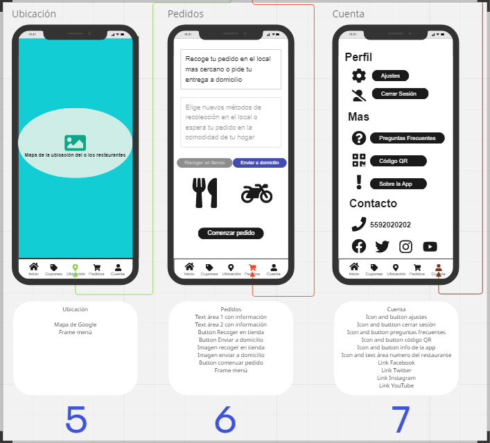
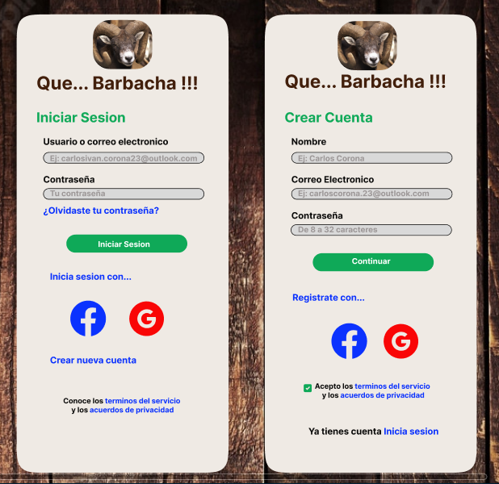
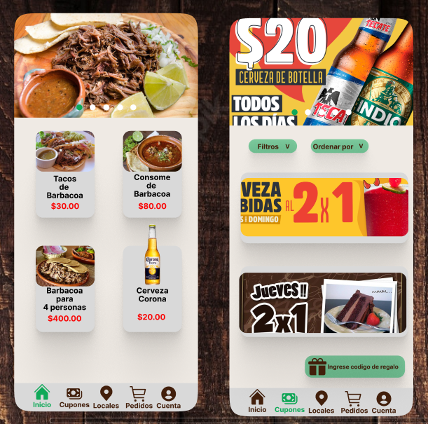
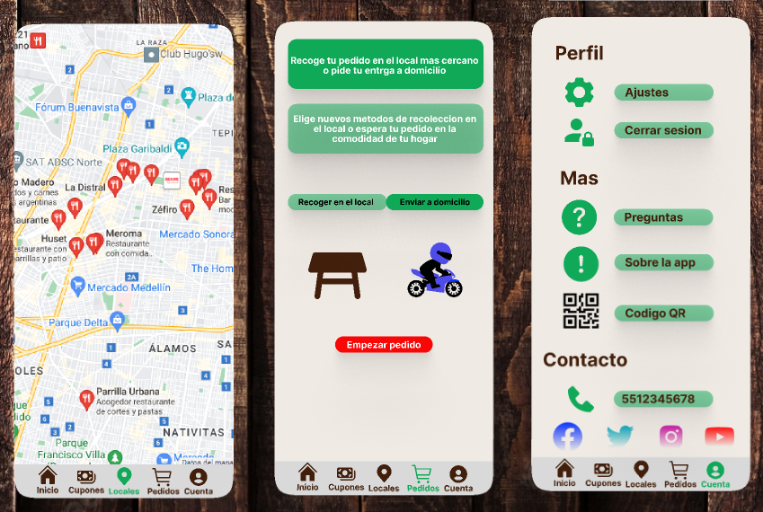

# Practica Diseño :framed_picture:

## Toma de requerimientos
El cliente solicita una App para su restaurante, en la cual pueda mostrar los alimentos que ofrece en su establecimiento quiere tener presencia en el medio digital y poder competir contra otras cadenas de restaurantes a nivel nacional.

- Nombre del proyecto: ¡¡¡App Que Barbacha!!!
- Fecha de solicitud: 01/10/2022
- Responsable del desarrollo de la App: Carlos Corona

Requisitos técnicos:

- Tipo de desarrollo: Desarrollo móvil
- Base de datos: MySQL
- Lenguaje: HTML, CSS, JavaScript 
- Diseño: Miro, Figma

UX y UI

- Sección iniciar sesión: El usuario iniciara sesión con su correo electrónico y contraseña o con la red social que haya enlazado.

- Sección crear cuenta: El usuario tendrá que registrar su nombre, un correo electrónico valido y una contraseña o podrá hacer su registro por medio de Facebook o Google.

- Sección inicio: Se mostrarán un panel donde aparezcan los platillos destacados y noticias del restaurante, además estarán todos los platillos y bebidas del restaurante.

- Sección cupones: Se mostrará un panel donde estarán los cupones del día y en la parte de abajo abran mas cupones y una sección donde el usuario podrá canjear un cupón de regalo por medio de un código.

- Sección ubicación: Esta sección tendrá un mapa de Google donde se mostrarán la ubicación de todos los locales. 

- Sección pedidos: En esta sección el usuario podrá hacer un pedido y tendrá la oportunidad de decidir si quiere recoger su pedido en el local mas cercano o pedir que sea enviado a su domicilio.

- Sección cuenta: En esta sección abran más opciones disponibles para el usuario y estarán divididas de la siguiente manera: (Perfil: ajustes y cerrar sesión), (Mas: Preguntas frecuentes, Sobre la App y Código QR) y (Contacto: Número telefónico del restaurante y redes sociales).

Diagrama de Flujo

## Buyer Persona :frowning_man:

## Publico Objetivo :family_man_woman_boy:

## Wireframe UX :iphone:

  

Te dejo el link directo a miro para que puedas ver con mayor detalle el UX :eyes: :point_right: [VER](https://miro.com/app/board/uXjVPOlOV5Y=/?share_link_id=577314465587)

## Diseño UI :iphone:

  

