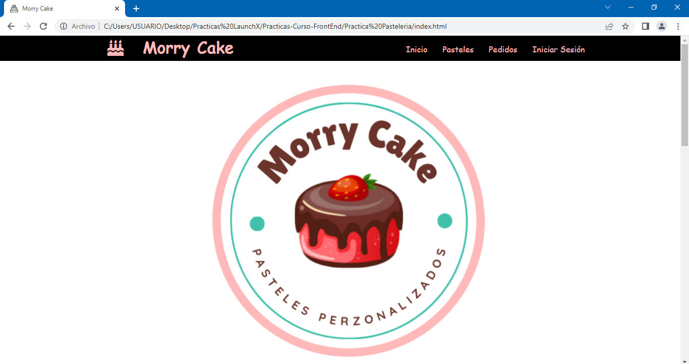
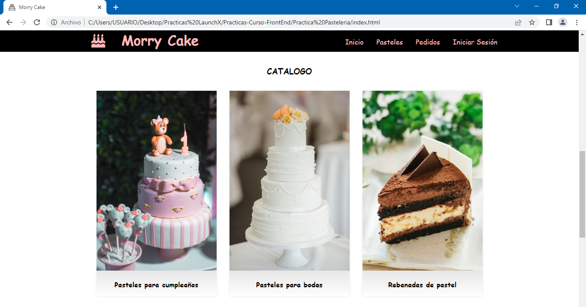
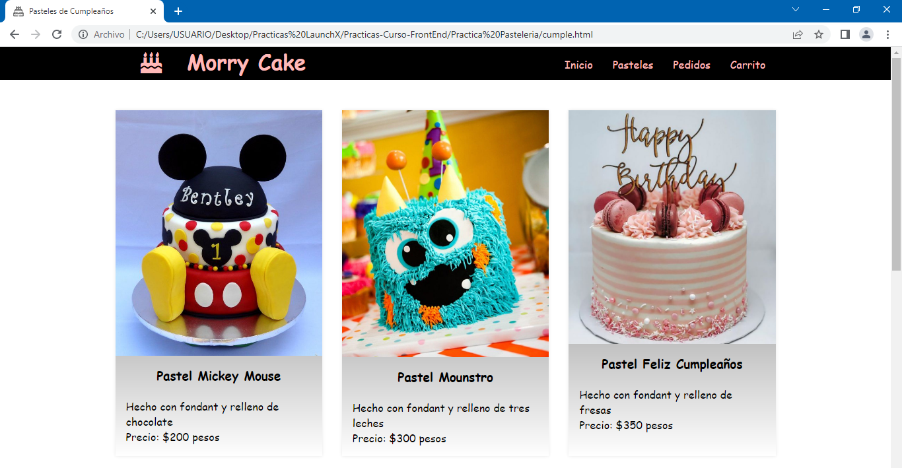
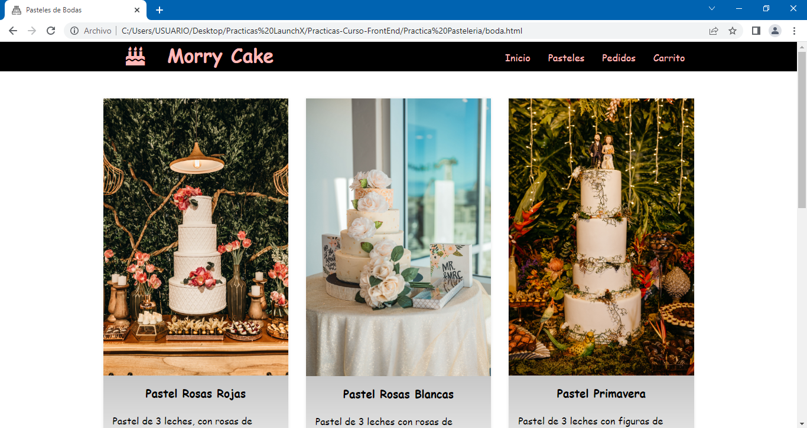
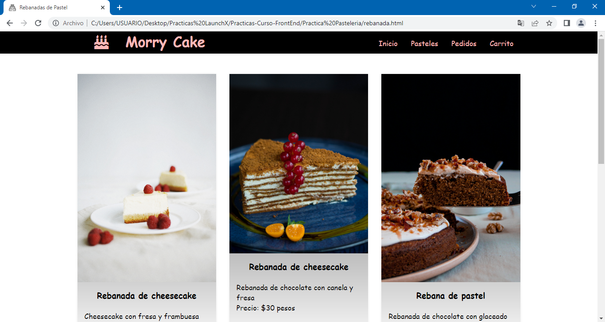
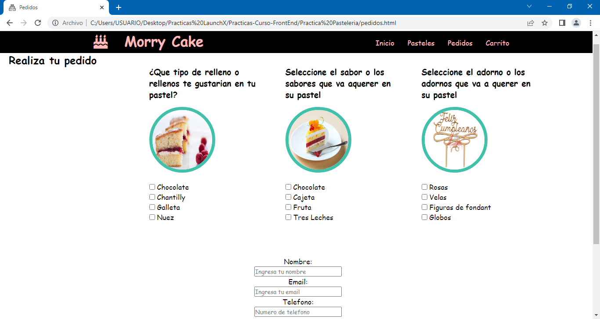
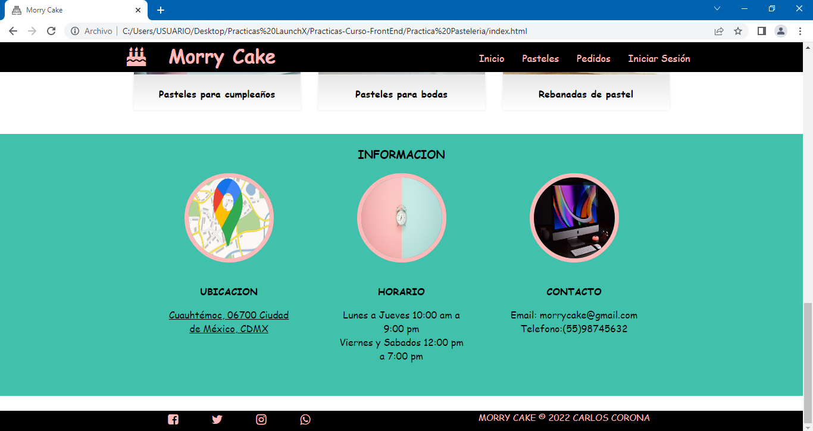
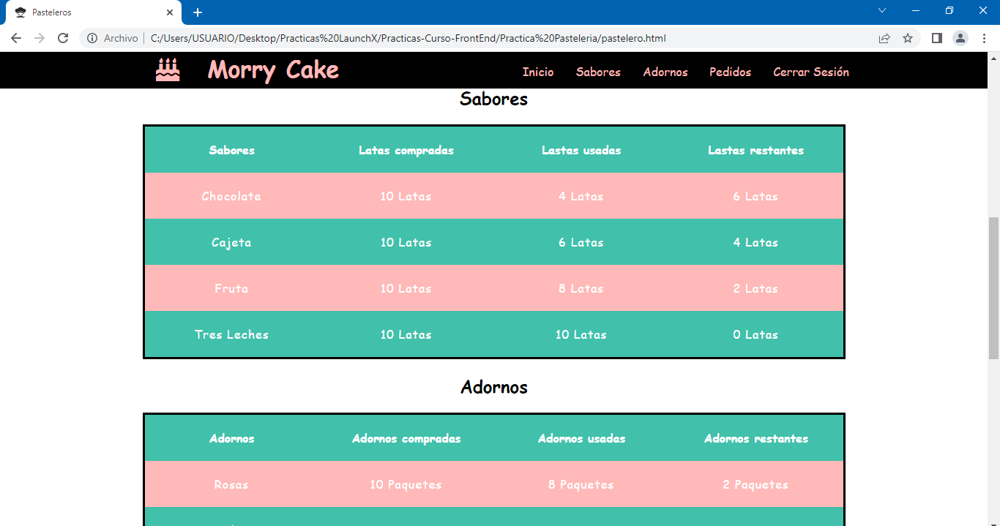
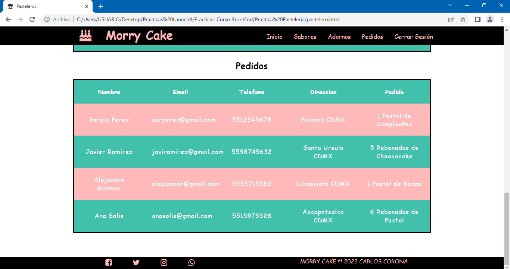

# Practica Pastelería :computer: :birthday:
Para esta práctica se tendrá que maquetar en HTML y CSS el siguiente caso.

Solamente se necesita maquetar como un prototipo, no es necesario que tenga funcionalidad completa en la información.

Descripción:

- El cliente de la pastelería necesita ver los diferentes sabores de pasteles, así como los precios de cada uno.
- El cliente de la pastelería necesita ver los diferentes adornos con los que se puede decorar el pastel y los precios de cada uno.
- El cliente de la pastelería tendrá la posibilidad de combinar sabores dependiendo de sus preferencias.
- El cliente de la pastelería tendrá la posibilidad de combinar adornos dependiendo de sus preferencias.
- El cliente de la pastelería necesita poner en un formulario su pedido.
- El formulario debe de contener los datos de contacto del cliente que son Nombre, Teléfono, Correo Electrónico, descripción general del pastel y la selección de sabores y adornos.
- El pastelero necesita tener la información de la cantidad de sabores que le quedan para hacer los pasteles.
- El pastelero necesita tener la información de la cantidad de adornos que le quedan para hacer los pasteles.
- El pastelero necesita una tabla donde aparezcan los pedidos que se han realizado con los datos del formulario.
- La página debe tener información de la pastelería que es Dirección, Teléfono y horarios de atención.

## Prácticas:

- Crear marca de la pastelería como un logo y los mensajes que daremos desde la marca.
- Maquetación de páginas de cliente de la pastelería.
- Maquetación de páginas del pastelero.

### Bonus:

- Bonus de estilos (Intro a CSS)
- Bonus de Rutas (Navegación en la página)
- Bonus de despliegue (Montar la página en línea con dominio gratuito)

## Te dejo algunas capturas de pantalla de la página web

### Cliente

***Te dejo el link directo de la página web cliente, ¡vamos vela tú mismo! :eyes: :point_right: [LINK](https://charliecrown.github.io/Morry-Cake/)***

### Pastelero

***Te dejo el link directo de la página web pastelero, ¡vamos vela tú mismo! :eyes: :point_right: [LINK](https://charliecrown.github.io/Morry-Cake/pastelero.html)***

[Volver al menú &ldca;](../README.md "Regresar a página principal")