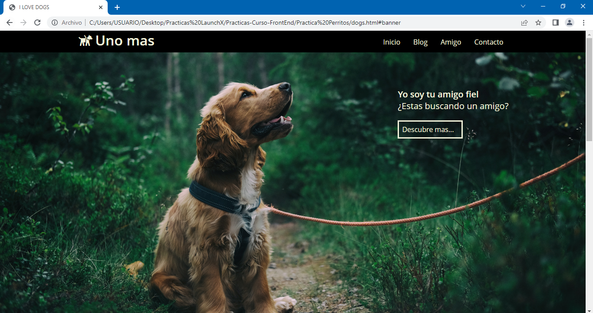
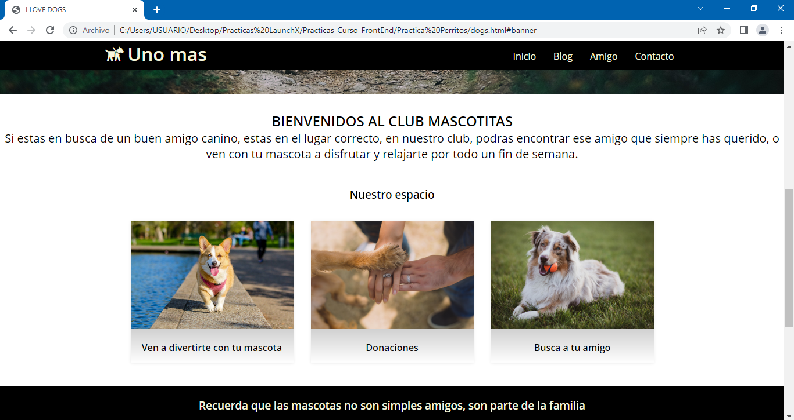
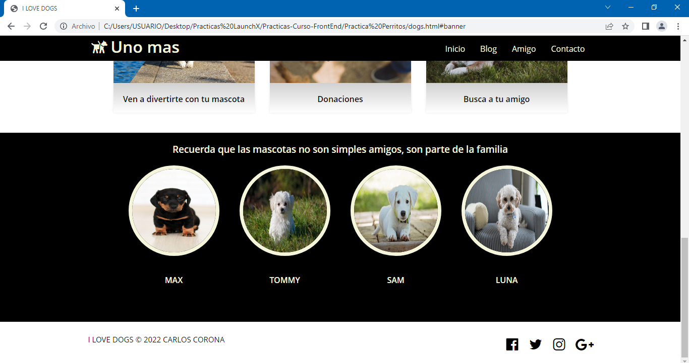

# Practica Club de Perros con HTML y CSS :computer: :dog:
Un club de perros solicita una pagina web, quieren tener precencia en el mercado digital y buscan 
competir contra otros clubs a nivel nacional.

- El sitio tendra una seccion de inicio, esta sera la primer parte de la pagina que aparecera cuando el
usuario entre al sitio web
- El sitio tendra un encabezado, que servira para que el usuario pueda navegar dentro de la pagina de una forma
mas comoda
- Tambien tendra una seccion de blog, donde se mostraran las diferentes actividades que ofrece el club
- Por ultimo se requiere que el sitio cuente con un footer, donde se muestren las redes sociales del club 
- El sitio debe ser responsive

## Te dejo algunas capturas de pantalla de la pagina web

***Tambien puedes ir al link directo de la pagina web, ¡vamos vela tu mismo! :eyes: :point_right: [LINK]()***

[Volver al menu &ldca;](../README.md "Regresar a página principal")