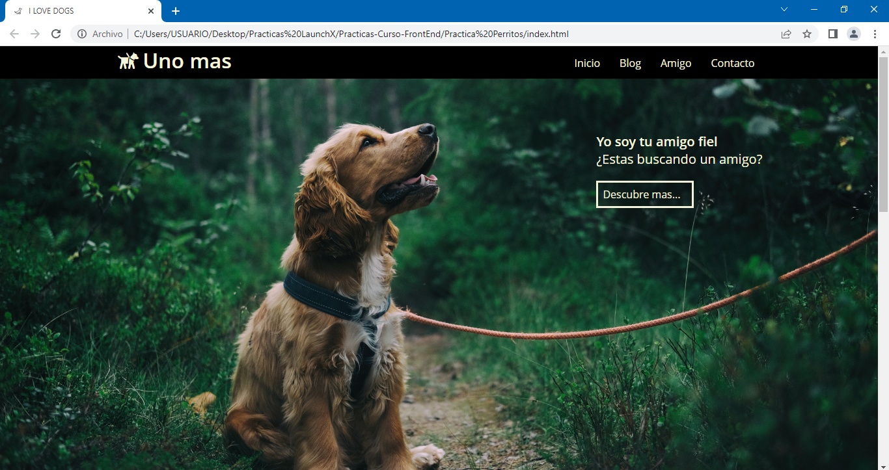
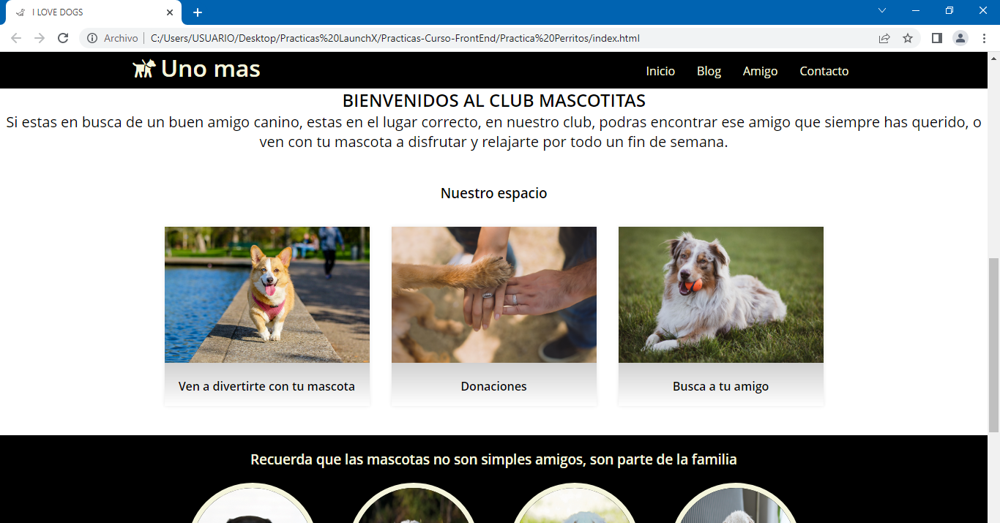
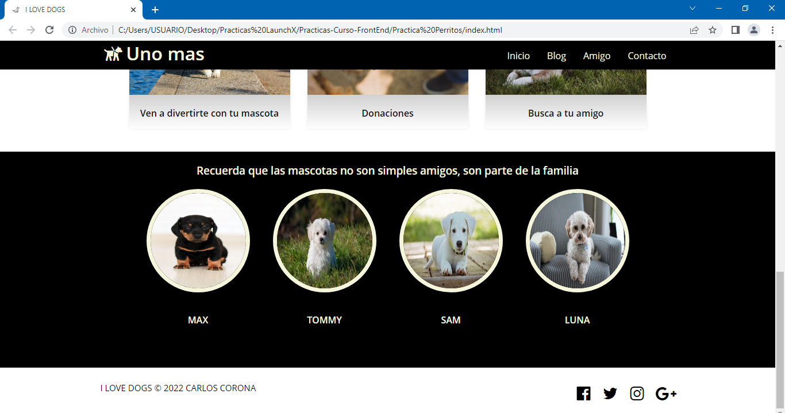

# Practica extra, Club de Perros :computer: :dog:
Un club de perros solicita una página web, quieren tener presencia en el mercado digital y buscan competir contra otros clubs a nivel nacional.

Descripción:

- El sitio tendrá una sección de inicio, esta será el primer parte de la página que aparece cuando el usuario entre al sitio web.
- El sitio tendrá un encabezado, que servirá para que el usuario pueda navegar dentro de la página de una forma más cómoda.
- También tendrá una sección de blog, donde se mostrarán las diferentes actividades que ofrece el club.
- Por último, se requiere que el sitio cuente con un footer, donde se muestren las redes sociales del club.

## Te dejo algunas capturas de pantalla de la página web

***También puedes ir al link directo de la página web, ¡vamos vela tú mismo! :eyes: :point_right: [LINK](https://charliecrown.github.io/Club-De-Perros/)***

[Volver al menú &ldca;](../README.md "Regresar a página principal")