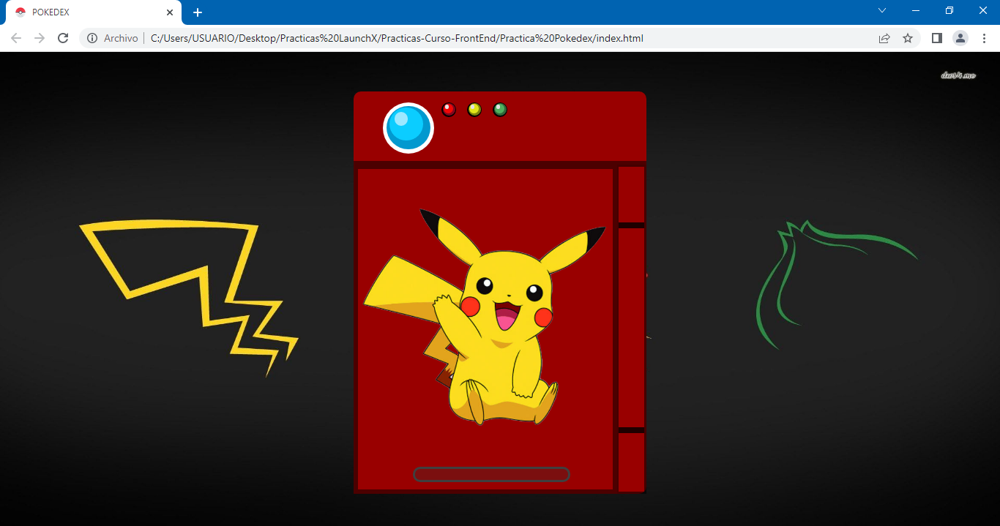

# Practica Pokedex :computer: :billed_cap:

En esta semana vimos como usar JavaScript para hacer que nuestras aplicaciones web tomen vida.
Así que empezaremos a crear la primer página web con JavaScript, la temática será maquetar una pokedex como se muestra en la siguiente imagen…

Descripción:

- Maquetación del sitio con HTML.
- Diseño con CSS para que parezca un pokedex la página.
- Tener un input de entrada, donde se meta el nombre del pokemón a buscar.
- Tomar ese input e ir a consultar el API de [pokeapi](https://pokeapi.co/).
- mostrar en pantalla los siguientes datos del pokemón ingresado.
    - Nombre
    - Imágen
    - Tipo de pokemón
    - Movimientos

Bonus:
- Bonus si tu página es responsive y se puede ver en celulares.
- Bonus de despliegue de tu pokedex.
- Bonus de uso de otras rutas como búsqueda por número de pokemón.

## Te dejo una captura de pantalla de la pokedex

***También puedes ir al link directo de la pokedex, ¡vamos vela tú mismo! :eyes: :point_right: [LINK]()***

[Volver al menú &ldca;](../README.md "Regresar a página principal")