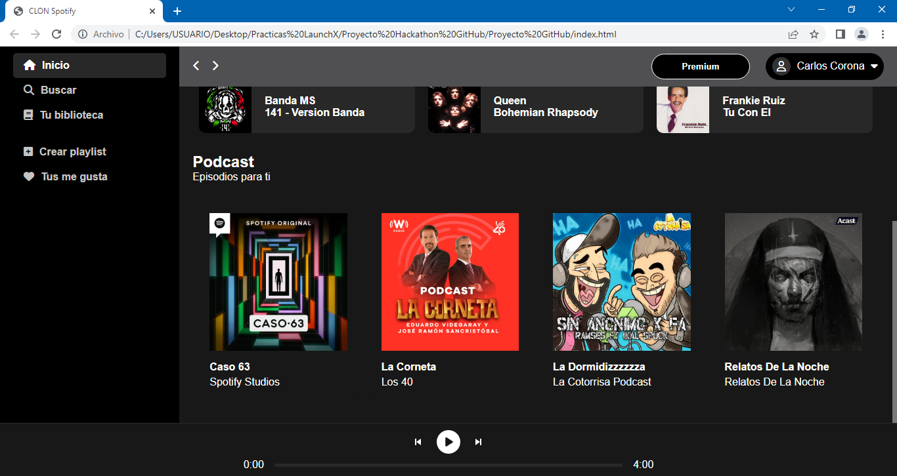

# Proyecto Hackathon GitHub :computer: :rocket:
## CLON de Spotify :musical_note:
El proyecto que presentare para el hackathon de GitHub es un clon de Spotify, decidí realizar este proyecto
porque me pareció muy interesante y divertido de hacer, entiendo que es un proyecto que mucha gente ya ha realizado, sin embargo, yo quise intentarlo.

El proyecto "Clon de Spotify" esta maquetado con HTML y CSS, por temas de tiempo y demás cosas no pude continuar con la parte del JavaScript, aunque como reto personal seguiré trabajando con el proyecto para que no solo sea una página estática. 

Gracias al curso de LaunchX/FrontEnd y al taller de GitHub, es que pude realizar este proyecto y como mencione, pretendo seguir trabajando con la página web, es un reto personal que quiero terminar.

## Te dejo algunas capturas de pantalla del proyecto

***También puedes ir al link directo del proyecto, ¡vamos velo tú mismo! :eyes: :point_right: [LINK](https://clondespotify.azurewebsites.net)***

[Volver al menú &ldca;](../README.md "Regresar a página principal")