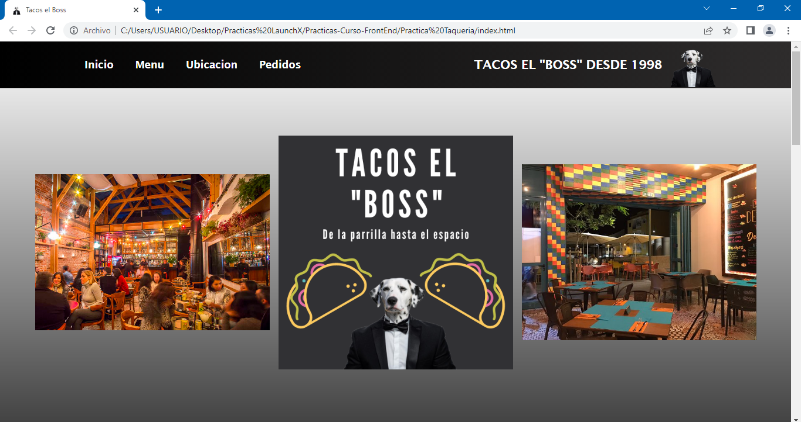
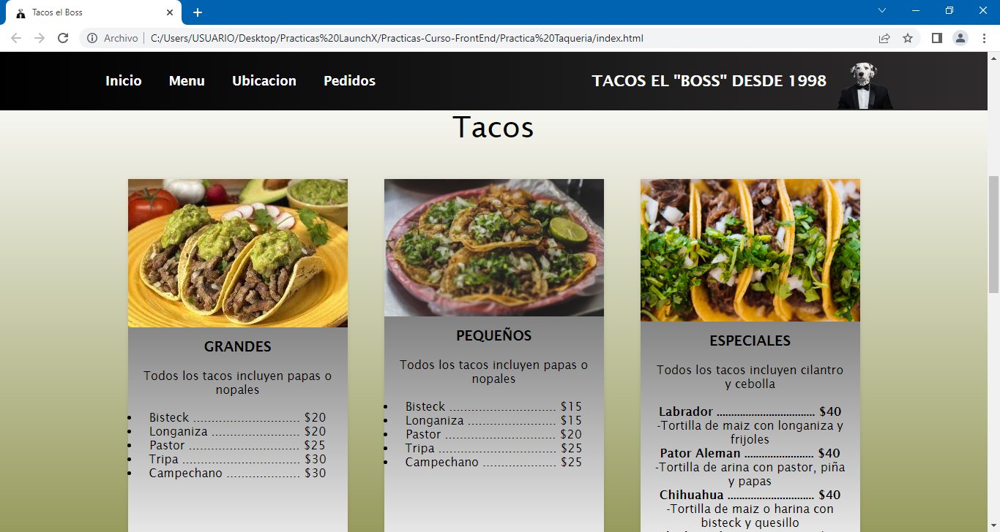
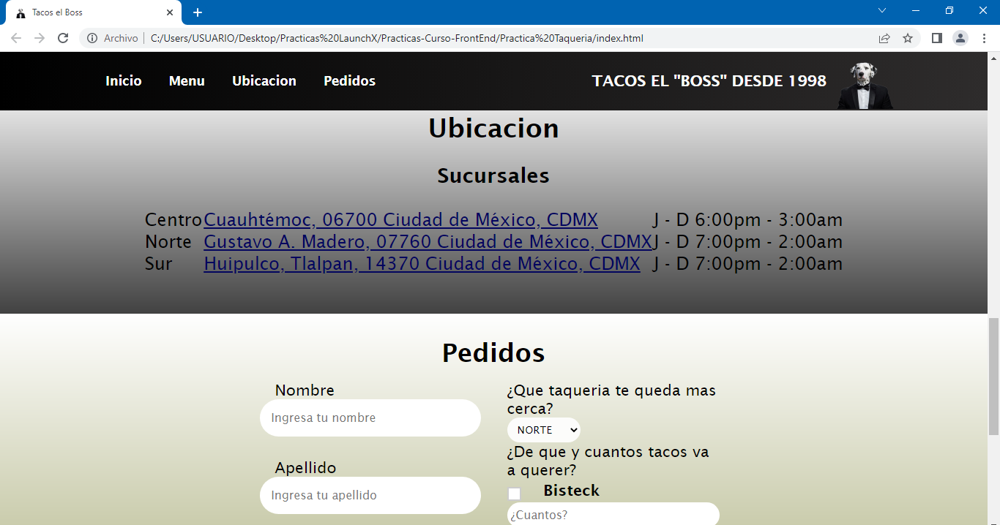
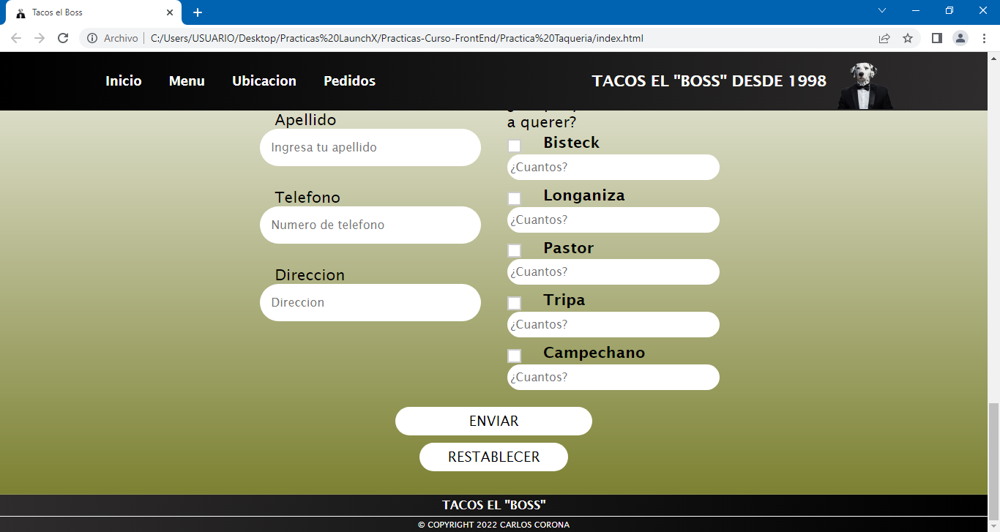

# Practica Taquería :computer: :taco:
Se solicita una página web para un negocio de tacos, el dueño del negocio busca que sus clientes puedan comprar sus tacos sin necesidad de ir al restaurante.

Descripción:

- El cliente podrá acceder a la página web y ver el menú del restaurante.
- El cliente podrá ver la ubicación y horarios de las diferentes sucursales de la taquería.
- Se solicita que la página web cuente con un formulario para poder hacer envíos a domicilio.
- Agregar un poco de CSS para adornar un poco el HTML.

## Te dejo algunas capturas de pantalla de la página web

***También puedes ir al link directo de la página web, ¡vamos vela tú mismo! :eyes: :point_right: [LINK](https://charliecrown.github.io/Taqueria/)***

[Volver al menú &ldca;](../README.md "Regresar a página principal")