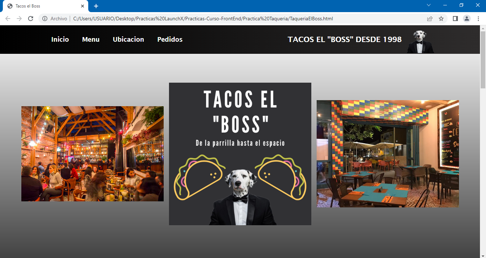
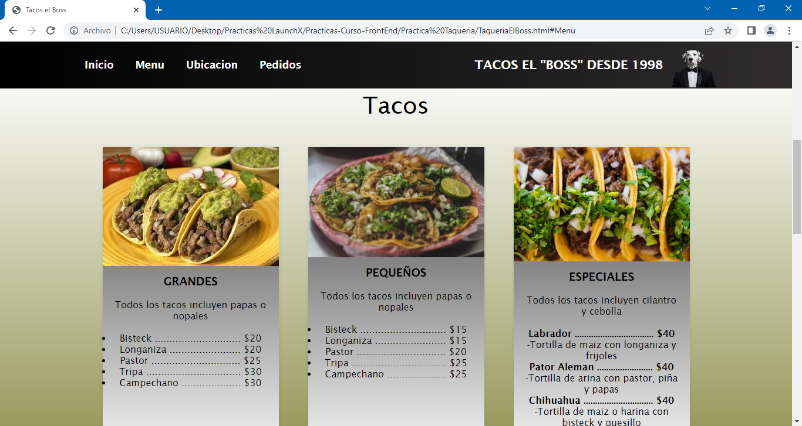
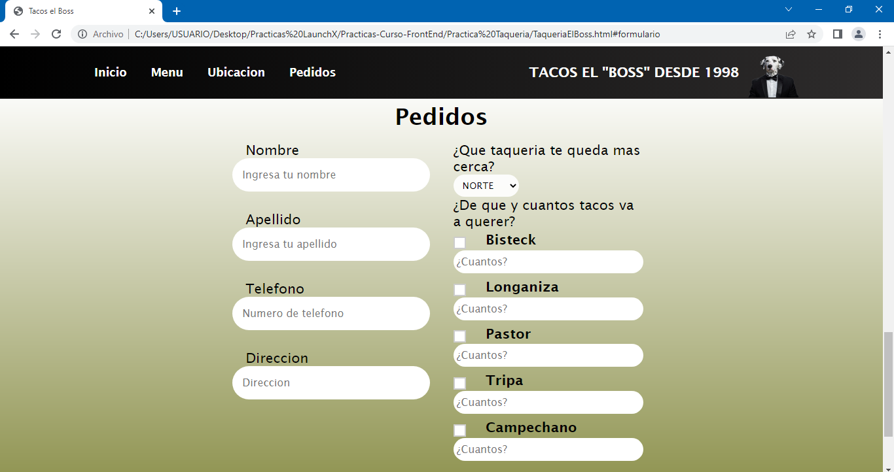

# Practica Taqueria con HTML :computer: :taco:
Se solicita una pagina web para un negocio de tacos, el dueño del negocio busca que sus clientes puedan
comprar sus tacos sin necesidad de ir al restaurante.

- El cliente podra acceder a la pagina web y ver el menu del restaurante
- El cliente podra ver la ubicacion y horarios de las diferentes sucursales de la taqueria
- Se solicita que la pagina web cuente con un formulario para poder hacer envios a domicilio
- Agregar un poco de css para adornar un poco el html

## Te dejo algunas capturas de pantalla de la pagina web

***Tambien puedes ir al link directo de la pagina web, ¡vamos vela tu mismo! :eyes: :point_right: [LINK]()***

