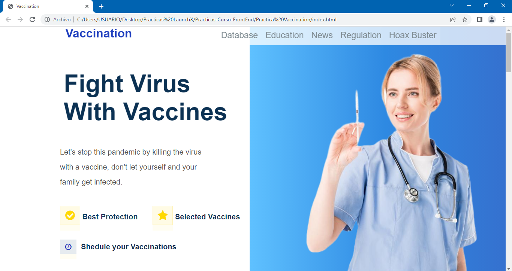
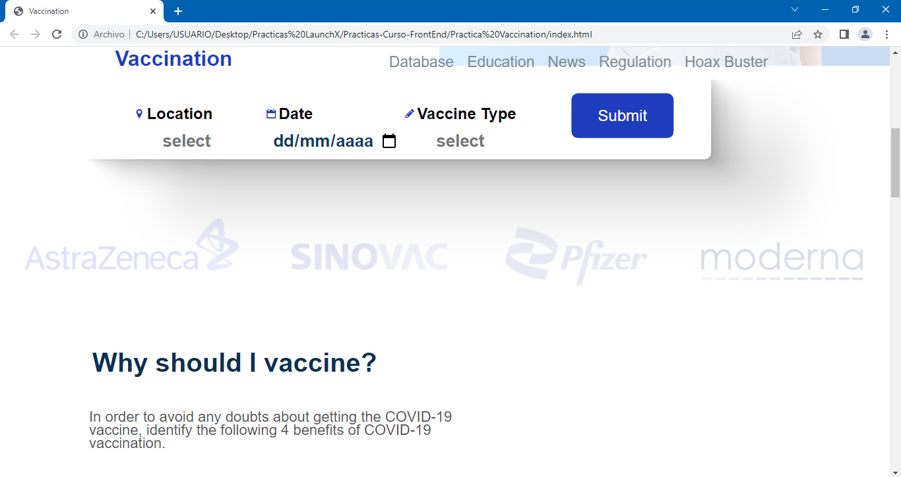
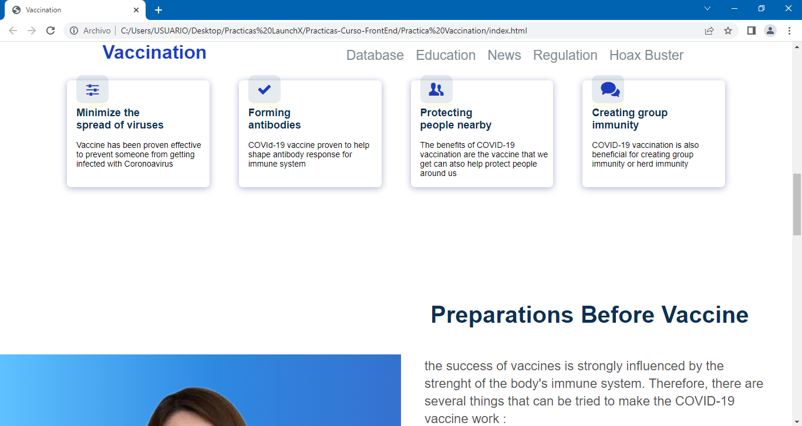
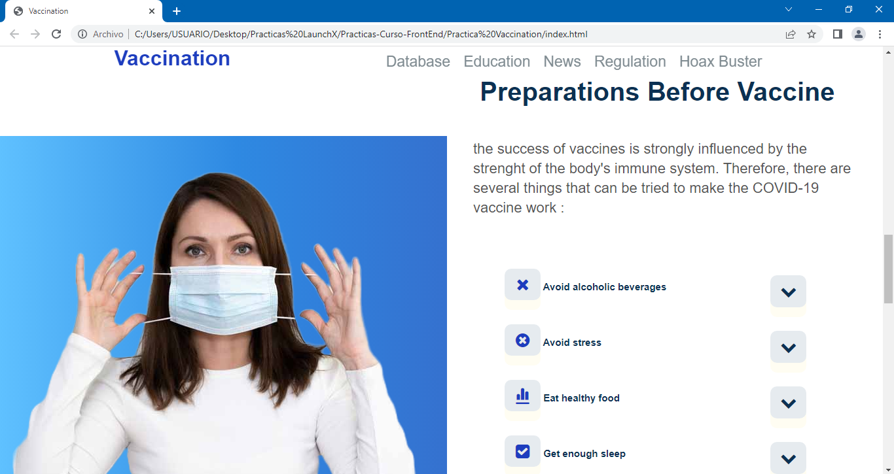
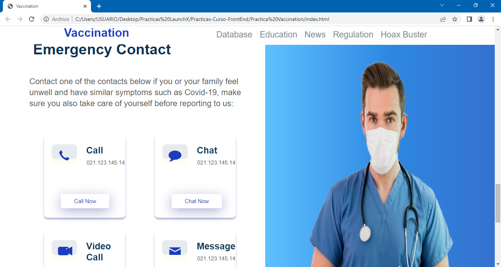
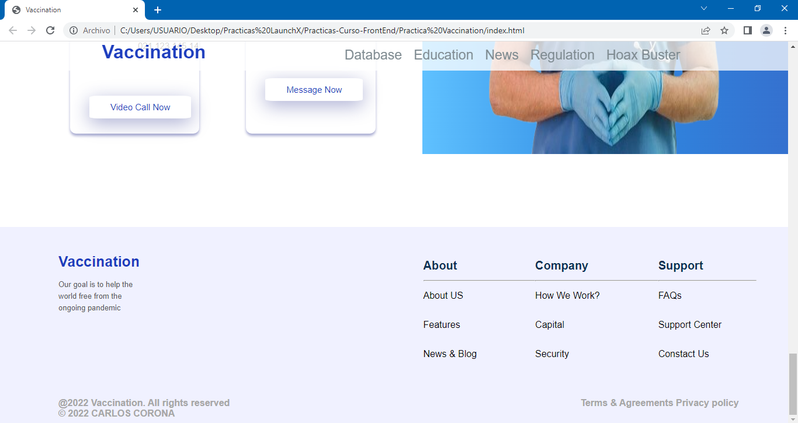

# Practica Vaccination :computer: :syringe:
Para esta práctica se requiere replicar la página que está en la siguiente imagen...

Design by [Adhiari Subekti](https://dribbble.com/Adhiari_is)

Como se puede ver es una página de vacunación y en estos momentos que se está poniendo la tercer dosis en varios estados de la república y que en algunos otros se está poniendo la segunda o incluso la primera sigue siendo muy importante recordar toda esta información.

La práctica consiste en lo siguiente:

- Maquetación del sitio con HTML.
- Estilos con CSS (Lo más acercado posible, pueden ser otras imágenes, íconos o colores, pero tiene que ser lo más cercano que se pueda).

Bonus:

- Bonus de despliegue de la página.

## Te dejo algunas capturas de pantalla de la página web replicada

***También te dejo el link directo de la página web, ¡vamos vela tú mismo! :eyes: :point_right: [LINK](https://charliecrown.github.io/Vaccination/)***

[Volver al menú &ldca;](../README.md "Regresar a página principal")