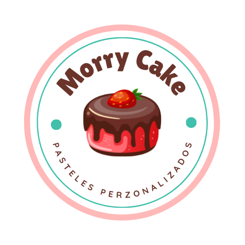
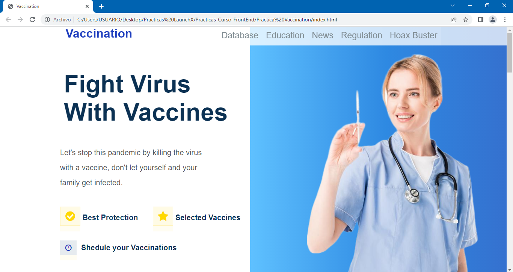
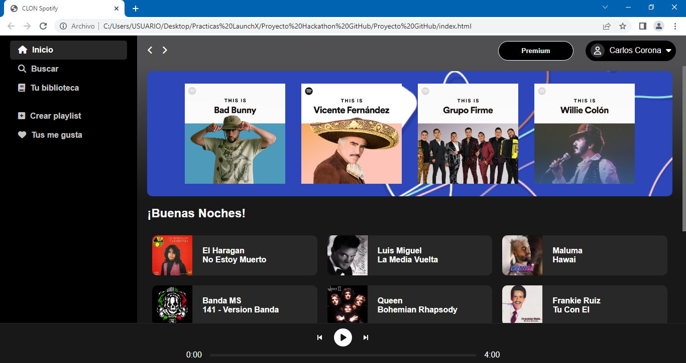
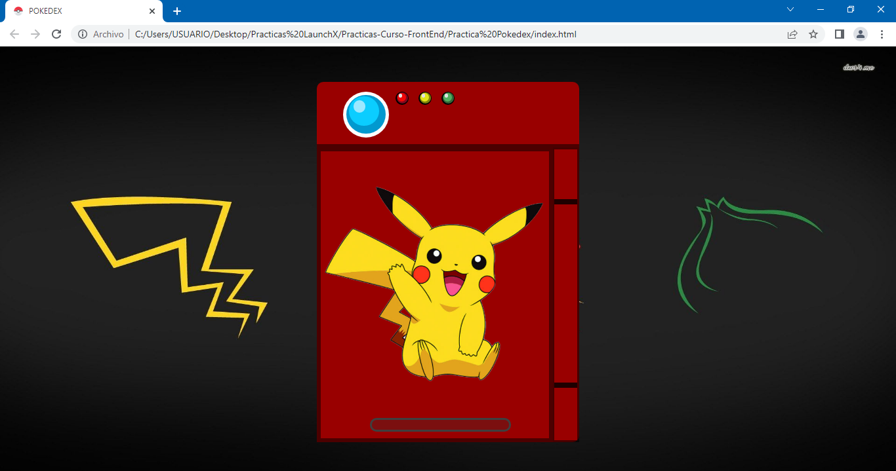

# Repositorio para todas las practicas del curso FrontEnd de InnovAccion Virtual LaunchX :man_astronaut: :rocket:
Bienvenidos a mi repositorio de prácticas de FrontEnd, en el encontraras practicas con HTML, CSS, JAVASCRIPT y diseños de UI, UX elaborados con la plataforma miro y Figma. :wink:	

## 1.- Practica Diseño :framed_picture:
La primer practica del curso está enfocada al diseño y toma de requerimientos para crear una página web, aquí encontraras una toma de requerimientos, un buyer persona, esquema público objetivo, wireframe UX y diseño de UI.

Tecnologías empleadas:

- miro
- Figma
- GitHub

***¡Adelante échale un vistazo! :eyes: :point_right: [VER](./Practica%20Dise%C3%B1o/README.md)***

## 2.- Practica Taquería :computer: :taco:
La segunda practica del curso está enfocada a HTML, esto para reforzar lo visto en el curso, aquí encontraras una página web creada a un negocio de tacos, es una buena practica para aprender HTML, y las diferentes cosas que se pueden usar en una pagina web.

Tecnologías empleadas:

- HTML
- CSS
- GitHub

***¡Adelante échale un vistazo! :eyes: :point_right: [VER](./Practica%20Taqueria/README.md)***

## 3.- Practica extra, Club de Perros :computer: :dog:
Esta es una práctica extra, decidí hacerla para practicar y mejorar mis habilidades de CSS, aquí encontraras una página web creada para un club de perros, cuenta con algunos estilos de CSS que hacen que la pagina web se pueda ver en celulares.

Tecnologías empleadas:

- HTML
- CSS
- GitHub

***¡Adelante échale un vistazo! :eyes: :point_right: [VER](./Practica%20Perritos/README.md)***

## 4.- Practica Pastelería :computer: :birthday:
Para la siguiente practica del curso, se pondrá en práctica los conocimientos aprendidos de HTML y CSS, aquí encontraras una página web creada a un pastelero, contiene paginas y diseños adicionales, como punto importante, la página es responsive. 

Tecnologías empleadas:

- HTML
- CSS
- GitHub

***¡Adelante échale un vistazo! :eyes: :point_right: [VER](./Practica%20Pasteleria/README.md)***

## 5.- Practica Vaccination :computer: :syringe:
En esta práctica se necesitó replicar una página web ya creada sobre la vacuna contra el COVID 19, esto para demostrar lo aprendido en el curso hasta el momento y reforzar nuestras habilidades de HTML Y CSS.

Tecnologías empleadas:

- HTML
- CSS
- GitHub

***¡Adelante échale un vistazo! :eyes: :point_right: [VER](./Practica%20Vaccination/README.md)***

## 6.- Proyecto Hackathon GitHub :computer: :rocket:
Para el Hackathon de GitHub, realice un clon de Spotify, maquetado con HTML y CSS, el proyecto aun no está terminado, ya que mi siguiente reto es trabajar con JavaScript y así tener una página web dinámica.

Tecnologías empleadas:

- HTML
- CSS
- GitHub
- Microsoft Azure

***¡Adelante échale un vistazo! :eyes: :point_right: [VER](./Practica%20Spotify/README.md)***

## 7.- Practica Pokedex :computer: :billed_cap:
Para esta practica pondremos lo aprendido de JavaScript, así que realice una pokedex con ayuda de la API “PokeAPI” para consultar datos de los pokemon. 

Tecnologías empleadas:

- HTML
- CSS
- JavaScript
- API PokeAPI
- GitHub

***¡Adelante échale un vistazo! :eyes: :point_right: [VER](./Practica%20Pokedex/README.md)***

